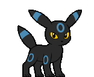

<!-- Contador de acessos -->


<div align="center">
   <!-- Nome -->

   <h2>
   </h2>
   
   <!-- Texto Dinamico -->
   
   
   <!-- Botões -->
   
   <a href="mailto:paulo.macedo@aluno.cefet-rj.br"></a> 
   <a href="https://www.linkedin.com/in/Paulemacedo/"></a> 
   <a href="https://paulemacedo.vercel.app/"></a> 
   <a href="https://tryhackme.com/p/paulemacedo"></a>
   
</div>

<!-- About Me -->

### [](https://github.com/paulemacedo#) 

<!--  -->

```json
{
  "name": "Paule Macedo",
  "pronouns": ["He/Him", "They/Them"],
  "studying": "Computer Science at CEFET/RJ",
  "learning": ["Linux", "Networking", "Cybersecurity"],
  "goals": "Cybersecurity internship"
}
```

<!-- Skills -->
### [](https://github.com/paulemacedo#-1) 

<!-- <div align="center">
   <a href="./Pages/Skills.md">
      
   </a>
</div> -->


<br>


<br>

 


<br>


<BR>


<br>


<!-- status -->
### [](https://github.com/paulemacedo#-2) 
<div align="center">
    <div>
        
        
    </div>

</div>


<!-- Trophies -->
### [](https://github.com/paulemacedo#-3) 
<div align="center">
   
</div>
